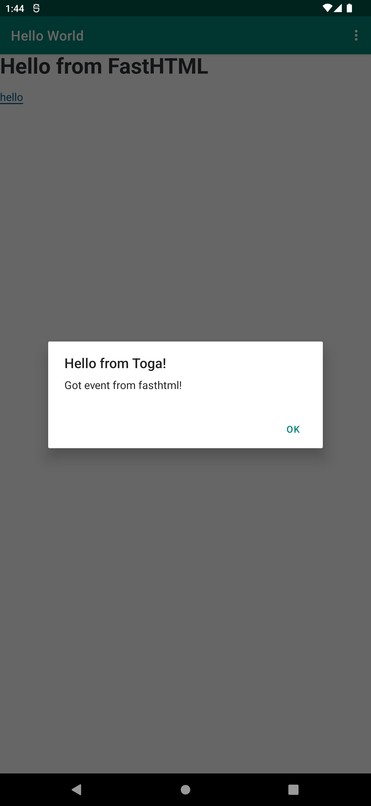

# toga_fasthtml
Toga + FastHTML boilerplate app with mobile (android tested) support.

Key features:
- Uses a message queue to send events from fastHTML to Toga.
- runs fastHTML in a background thread using daphne (uvicorn wasn't installable in android)
- reads from a message queue using an async task
- uses a forked version of fastHTML that removes uvicorn and apswutils requirements



## Installation
```
pip install -r requirements.txt
```

## Running in local desktop
```
cd helloworld
python -m briefcase dev
```

## Running in android (emulator or device)
```
cd helloworld

# one time initial setup
python -m briefcase create android   

# each time the code is updated
python -m briefcase update android 

python -m briefcase build android

# will prompt for either emulator or connected android device
python -m briefcase run android
```

## Updating the requirements 
```
# one time
pip install pip-tools
python -m piptools compile requirements.in
```

